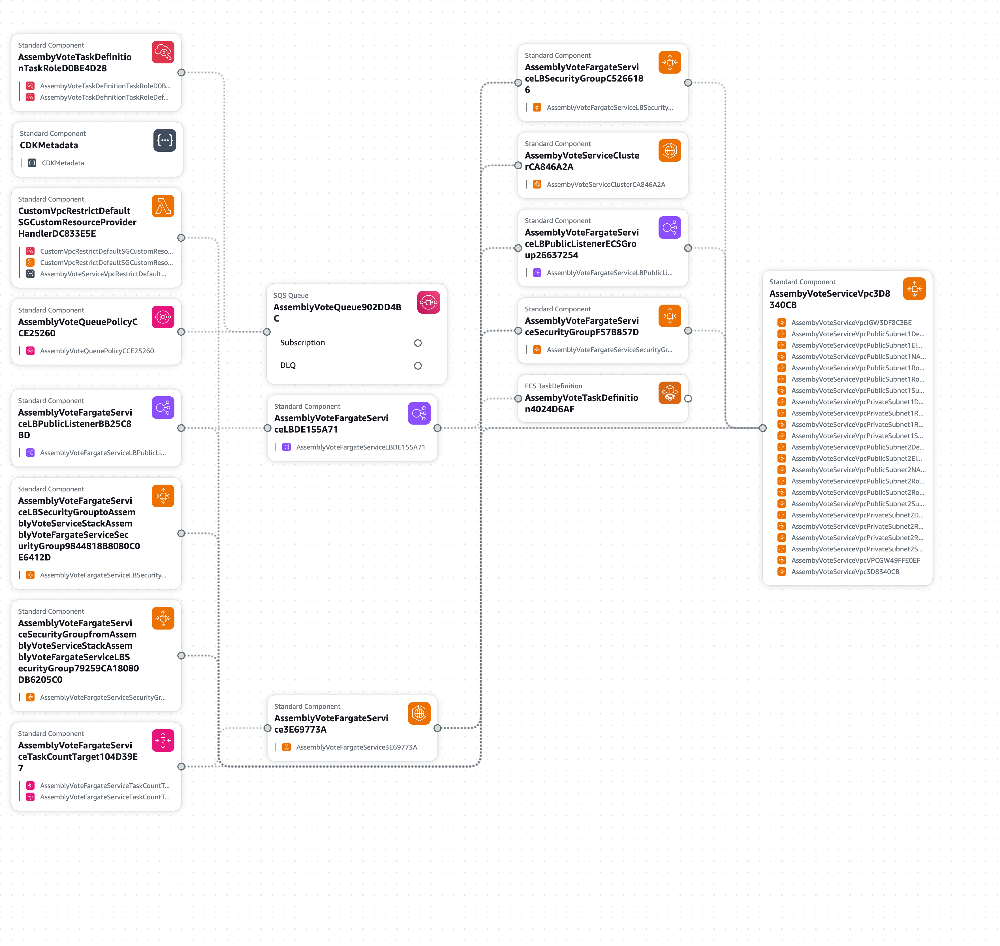

# Assembly Vote Service

## Overview

The Assembly Vote Service is a technical challenge from Sicredi. This project is designed to create new voting agendas and collect votes from members for each agenda. Additionally, it calculates the voting results and sends them to a queue for further processing.

## Cloud Infrastructure



## Project Settings

### 1. Versions

This project utilizes **Gradle 8.7** and **Java 21**. Please ensure you have compatible versions installed on your machine.

To check your current versions, run:

```bash
gradle --version
```
   Choose a version of Java 17 and install using [SDKMAN versions tutorial](https://sdkman.io/usage#listversions)

Run application
```bash
SPRING_PROFILES_ACTIVE=local gradle bootRun
```

## API Documentation and Endpoints

### Swagger Documentation

[Swagger UI](http://assemb-assem-cjj7okoqy8hw-1610945401.us-west-2.elb.amazonaws.com/swagger-ui/index.html)

### Example cURL Commands

Create Member:
```bash
curl --location 'http://Assemb-Assem-cjj7oKOQY8hw-1610945401.us-west-2.elb.amazonaws.com/api/v1/members' \
--header 'Content-Type: application/json' \
--data '{
    "cpf": "06992525042",
    "name": "Member A"
}'
```

Create Voting Agenda:
```bash
curl --location 'http://Assemb-Assem-cjj7oKOQY8hw-1610945401.us-west-2.elb.amazonaws.com/api/v1/voting/agendas' \
--header 'Content-Type: application/json' \
--data '{
    "title": "Voting Agenda Title",
    "description": "Voting agenda description"
}'
```


Create Voting Session:
```bash
curl --location --request PATCH 'http://Assemb-Assem-cjj7oKOQY8hw-1610945401.us-west-2.elb.amazonaws.com/api/v1/voting/agendas/{{agendaId}}/start/session' \
--header 'Content-Type: application/json' \
--data '{
    "start": "05/11/2024 16:30:00"
}'
```

Create Vote:
```bash
curl --location 'http://Assemb-Assem-cjj7oKOQY8hw-1610945401.us-west-2.elb.amazonaws.com/api/v1/voting/agendas/{{agendaId}}/member/{{memberId}}' \
--header 'Content-Type: application/json' \
--data '{
    "vote": "NO"
}'
```

Get Voting Agenda Result:
```bash
curl --location 'http://Assemb-Assem-cjj7oKOQY8hw-1610945401.us-west-2.elb.amazonaws.com/api/v1/voting/agendas/{{agendaId}}/result'
```

If you'd like to run the code locally, you can simply replace the ALB URL with localhost:8080

## Technical Decisions Explanations:

### Why Use Another API Instead of the Suggested API?

I noticed that the suggested API was not functional, as it threw an error when attempting to validate the CPF.

### Why Use ECS Fargate?

In this case, since we are creating a small API, I believe that the best approach is to use ECS Fargate. This is because I do not need an EC2 instance, and Fargate provides fully managed instances that are ready to use.

### Why Use Spring Scheduler?

In this case, I implemented Spring Scheduler due to time constraints, as this solution is easy to implement. However, I understand that a better approach would be to create a new AWS Lambda function and configure an EventBridge rule to invoke the Lambda. Then, the Lambda would handle all the necessary work, calling a new endpoint and sending the results to an SQS queue.

### Why Use SQS?

Since this service was built using AWS, I believe the best approach is to continue using AWS services because it provides great integration and control over the service.

### Why Call Directly My Load Balancer?

As I still don't have a domain, I had to create the Application Load Balancer as public and make endpoint calls through this Load Balancer's address.

### Why Use CDK?

Currently, the CDK is the best approach to implement IaC, as I can simply write my infrastructure as code and then deploy it.

### How about the API performance?

I've implemented an auto-scaling rule to increase the number of instances when the current instance reaches 80% usage. This improves scalability and helps ensure the API can handle higher loads effectively.

### Why not write integration test for the rest of the endpoints

I would like! But I didn't have enough time